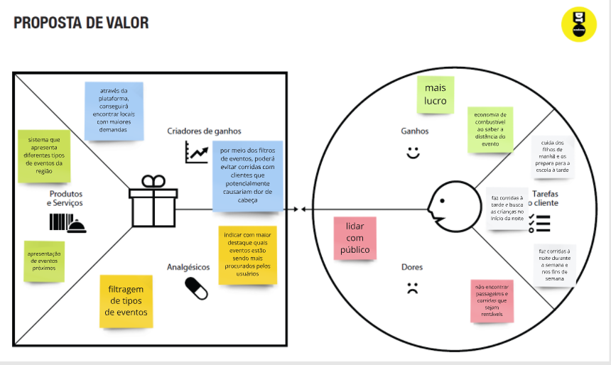
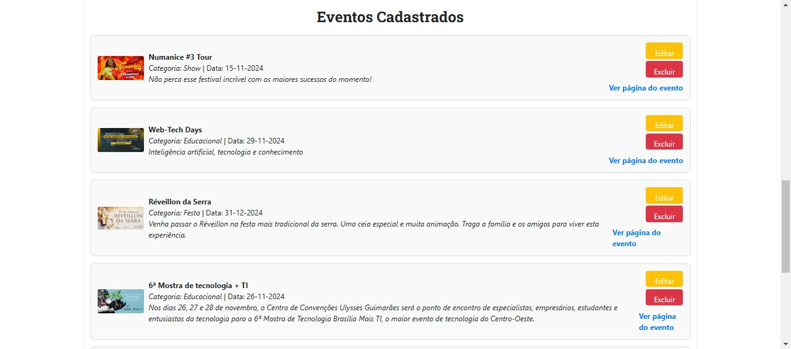

# Introdução

Informações básicas do projeto.

* **Projeto:** Eventful
* **Repositório GitHub:** [Repositorio](https://github.com/ICEI-PUC-Minas-PMGCC-TI/ti-1-ppl-cc-m-20242-eventos-proximos)
* **Membros da equipe:**

  * [Bruna Noely](https://github.com/brunanoely)
  * [Caio Fernandes](https://github.com/caionesess)
  * [Gabriel Lucas](https://github.com/Gabriellsmm)
  * [Joao Pedro](https://github.com/Jopefv) 
  * [Julia Santos](https://github.com/ajuliasantos)
  * [Kamily Vitória](https://github.com/kamivss)
  * [Rafael Henrique](https://github.com/Rafaelhs2005)

A documentação do projeto é estruturada da seguinte forma:

1. Introdução
2. Contexto
3. Product Discovery
4. Product Design
5. Metodologia
6. Solução
7. Referências Bibliográficas

✅ [Documentação de Design Thinking (MIRO)](files/Documentacao.pdf)

# Contexto

Em um mundo em que as informações estão fragmentadas em vários lugares ao mesmo tempo, a busca por clareza nunca esteve tão fácil, mas ao mesmo tempo tão complicada - especialmente quando se trata do planejamento de um evento externo. Dessa forma, esse projeto visa otimizar o tempo e facilitar a vida de todos que estão envolvidos neste espectro, desde os jovens da vida noturna, até aqueles que tornam os eventos possíveis.


## Problema

Atualmente, muitas pessoas têm dificuldade em encontrar eventos próximos que se alinhem com seus interesses específicos. A fragmentação de informações sobre eventos em diferentes plataformas e a falta de centralização dificultam a descoberta de opções culturais, sociais e recreativas. Além disso, usuários enfrentam o problema de não conseguir obter detalhes sobre eventos locais, como data, local, tipo de público, ingressos e atividades envolvidas, de maneira rápida e confiável. Isso pode resultar em uma perda de oportunidades para frequentar eventos relevantes ou em frustrações por não encontrar o que procuram.


## Objetivos

O objetivo principal do site de encontrar eventos próximos é oferecer uma plataforma fácil de usar que centralize e organize informações sobre eventos locais de acordo com as preferências e localização do usuário. Alguns dos objetivos específicos incluem:

* Centralizar informações: Reunir eventos de diversas fontes, como redes sociais, sites especializados e organizadores de eventos.
* Facilitar a busca personalizada: Permitir que os usuários filtrem eventos por localização, categoria, data, faixa de preço e preferências pessoais.
* Oferecer notificações personalizadas: Enviar alertas quando novos eventos de interesse surgirem próximos à localização do usuário.
* Melhorar a experiência do usuário: Proporcionar uma interface simples e intuitiva, com descrições detalhadas dos eventos, permitindo fácil navegação e divulgação.


## Justificativa

A justificativa para o desenvolvimento de um site de encontrar eventos próximos baseia-se na crescente demanda por uma plataforma centralizada e eficiente para ajudar as pessoas a descobrirem eventos que atendam a seus interesses e localização. A fragmentação de informações em diversas plataformas dificulta a experiência tanto para os usuários, que não encontram facilmente eventos relevantes, quanto para os organizadores, que buscam maior visibilidade. Um site que simplifique esse processo, oferecendo busca personalizada e notificações, pode melhorar o engajamento, apoiar pequenos eventos e aumentar a participação em atividades locais.


## Público-Alvo

O público-alvo principal desse site inclui:

*  Jovens adultos e estudantes: Pessoas entre 18 e 35 anos que buscam atividades recreativas, sociais e culturais em suas cidades ou em locais próximos.
*  Profissionais ocupados: Pessoas com horários limitados que querem otimizar seu tempo livre participando de eventos de interesse, mas têm dificuldades para encontrar opções facilmente.
*  Organizadores de eventos: Profissionais e empresas que buscam divulgar seus eventos para públicos segmentados e aumentar a participação.
*  Turistas e visitantes: Pessoas em viagens que desejam descobrir atividades e eventos locais durante sua estadia.
*  Motoristas de aplicativo: que buscam otimizar seus ganhos e conseguir achar mais 

>[Personas e proposta de valor](files/Persona.pdf)


# Product Discovery

## Etapa de Entendimento


[Product Discovery](files/productDiscovery.pdf)


## Etapa de Definição

### Personas


# Product Design

Nesse momento, vamos transformar os insights e validações obtidos em soluções tangíveis e utilizáveis. Essa fase envolve a definição de uma proposta de valor, detalhando a prioridade de cada ideia e a consequente criação de wireframes, mockups e protótipos de alta fidelidade, que detalham a interface e a experiência do usuário.

## Histórias de Usuários

Com base na análise das personas foram identificadas as seguintes histórias de usuários:

| EU COMO...`PERSONA` | QUERO/PRECISO ...`FUNCIONALIDADE`        | PARA ...`MOTIVO/VALOR`               |
| --------------------- | ------------------------------------------ | -------------------------------------- |
| Jovem de 19 anos  | De informações e comentários de outros usuários a respeito do evento | Ir ao evento com segurança, já sabendo a procedência            |
| Jovem de 19 anos         | Saber os eventos próximos a mim      | Me programar e conhecer lugares e pessoas novas |
| Motorista de Aplicativo        | Saber os tipos de eventos próximos a mim a partir de filtros     | Selecionar melhor os tipos de passageiros que lidarei |
| Motorista de Aplicativo        | Ter conhecimento de quais eventos estão sendo mais acessados/procurados  | Obter corridas mais rentáveis com maior lucro |
| Produtor de Eventos       | Um espaço para condensar informações do meu evento e eventuais mudanças  | Não ter informações desconexas e perdidas em múltiplas plataformas, causando desinteresse no público |
| Produtor de Eventos       | Destaque para o evento que estou promovendo  | Atingir meu público-alvo |

## Proposta de Valor





## Requisitos

As tabelas que se seguem apresentam os requisitos funcionais e não funcionais que detalham o escopo do projeto.

### Requisitos Funcionais

| ID     | Descrição do Requisito                                   | Prioridade |
| ------ | ---------------------------------------------------------- | ---------- |
| RF-001 | Exibir as avaliações dos eventos | MÉDIA       |
| RF-002 | Exibir o local, horário e lotação dos eventos | ALTA     |
| RF-003 | Mecanismos de filtragem dos eventos por preferências | ALTA     |
| RF-004 | Espaço para divulgação de eventos | ALTA     |
| RF-005 | Redirecionamento dos usuários interessados para a compra de ingressos ou inscrições dos eventos | MÉDIA     |
| RF-006 | Notificações sobre eventos com base nas preferências dos usuário | MÉDIA     |
| RF-007 | Permitir o cadastro e login de usuários | MÉDIA     |

### Requisitos não Funcionais

| ID      | Descrição do Requisito                                                              | Prioridade |
| ------- | ------------------------------------------------------------------------------------- | ---------- |
| RNF-001 | O sistema deve suportar no mínimo 10000 acessos simultâneos sem comprometer o desempenho | MÉDIA     |
| RNF-002 | O sistema deve garantir a segurança dos dados de todos os usuários | ALTA      |
| RNF-003 | O sistema deve ser compatível com todos os dispositivos atuais | MÉDIA      |
| RNF-004 | O sistema deve estar disponível 24/7 | ALTA      |
| RNF-005 | O sistema deve retornar os resultados de busca em no máximo 1 segundo | MÉDIA      |
| RNF-006 | O sistema deve ser intuitivo e de fácil utilização | ALTA      |


## Projeto de Interface

Artefatos relacionados com a interface e a interacão do usuário na proposta de solução.

### Wireframes

Estes são os protótipos de telas do sistema.

### Tela de cadastro

Tela para usuarios se cadastrarem tanto como usuarios comuns como produtores


### Tela de Login

Tela para os usuarios logarem na conta


### Tela inicial

Tela inicial do usuario comum que mostra os eventos que estão para acontecer com abas de pesquisa e filtragem


### Descrição dos eventos

Tela que mostra a descrição do evento


### Area Produtor

Tela para o controle das divulgaçoes dos produtores


### Eventos mais visitados

Tela com os eventos mais acessados


### User Flow


### Protótipo Interativo

✅ [Protótipo Interativo (MarvelApp)](https://marvelapp.com/prototype/1b81d4a4)  

# Metodologia

Detalhes sobre a organização do grupo e o ferramental empregado.

## Ferramentas

Relação de ferramentas empregadas pelo grupo durante o projeto.

| Ambiente                    | Plataforma | Link de acesso                                     |
| --------------------------- | ---------- | -------------------------------------------------- |
| Processo de Design Thinking | Miro       | https://miro.com/app/board/uXjVKoWGKQ8=/        |
| Repositório de código     | GitHub     | https://github.com/ICEI-PUC-Minas-PMGCC-TI/ti-1-ppl-cc-m-20242-eventos-proximos   |
| Protótipo Interativo       | MarvelApp  | https://marvelapp.com/prototype/1b81d4a4   |
|                             |            |                                                    |

# Solução Implementada

Esta seção apresenta todos os detalhes da solução criada no projeto.

## Vídeo do Projeto

O vídeo a seguir traz uma apresentação do problema que a equipe está tratando e a proposta de solução.

[](https://www.youtube.com/embed/70gGoFyGeqQ) //colocar link

## Funcionalidades

Esta seção apresenta as funcionalidades da solução.Info

##### Funcionalidade 1 - Cadastro de Eventos

Permite o cadastro, leitura, alteração e exclusão de eventos para o sistema.

* **Estrutura de dados:** Eventos, Enderecos, Categorias
* **Instruções de acesso:**
  * Abra o site e efetue o login
  * Acesse o menu principal e clique no perfil do usuário
  * Em seguida, escolha a opção Cadastrar Evento
* **Tela da funcionalidade**:




##### Funcionalidade 2 - Tela Inicial / Filtragem dos Eventos

Permite a visualização e a filtragem com base nas categorias dos eventos.

* **Estrutura de dados:** Eventos, Categorias
* **Instruções de acesso:**
  * Abra o site e efetue o login
  * Visualize a página e filtre as categorias
* **Tela da funcionalidade**:


##### Funcionalidade 3 - Detalhes do Evento / Confirmação do Evento / Avaliações do Evento

Permite a visualização das informações do evento, além de permitir o usuário a deixar um comentário, favoritar e confirmar sua presença.

* **Estrutura de dados:** Eventos, Enderecos, Categorias, Confirmacao, Avaliacoes, Favoritos
* **Instruções de acesso:**
  * Abra o site e efetue o login
  * Clique em um dos eventos exibidos na tela
* **Tela da funcionalidade**:


##### Funcionalidade 4 - Mapa dos Eventos

Permite a visualização dos eventos em um mapa para que o usuário veja os mais próximos e veja a página de detalhes ao clicar sobre o evento.

* **Estrutura de dados:** Eventos, Enderecos
* **Instruções de acesso:**
  * Abra o site e efetue o login
  * Clique em Mapa de Eventos no menu inicial
* **Tela da funcionalidade**:


##### Funcionalidade 5 - Página do Usuário

Permite a visualização dos eventos cadastrados(se houver), e um menu lateral para escolher uma página a ser direcionado.

* **Estrutura de dados:** Eventos, Enderecos, Categorias
* **Instruções de acesso:**
  * Abra o site e efetue o login
  * Clique no perfil do usuário no menu inicial
* **Tela da funcionalidade**:


##### Funcionalidade 6 - Gráficos dos Produtores

Permite a visualização dos eventos cadastrados mais favoritados e com mais confirmações (se houver), e um menu lateral para escolher uma página a ser direcionado.

* **Estrutura de dados:** Eventos, Favoritos, Confirmacoes
* **Instruções de acesso:**
  * Abra o site e efetue o login
  * Clique no perfil do usuário no menu inicial
  * Clique em Mais Favoritados e Mais Confirmados
* **Tela da funcionalidade**:


##### Funcionalidade 7 - Notificações

Exibe notificações a respeito dos eventos que interessam o usuário baseando-se nos seus favoritos.

* **Estrutura de dados:** Eventos, Favoritos
* **Instruções de acesso:**
  * Abra o site e efetue o login
  * Clique no perfil do usuário no menu inicial
  * Clique em Notificações
* **Tela da funcionalidade**:


##### Funcionalidade 8 - Calendário

Exibe um calendário com os eventos confirmados pelo usuário.

* **Estrutura de dados:** Eventos, Confirmacoes
* **Instruções de acesso:**
  * Abra o site e efetue o login
  * Clique no perfil do usuário no menu inicial
  * Clique em Calendário
* **Tela da funcionalidade**:


##### Funcionalidade 8 - Seus Favoritos

Permite a visualização dos eventos favoritados pelo usuário.

* **Estrutura de dados:** Eventos, Favoritos
* **Instruções de acesso:**
  * Abra o site e efetue o login
  * Clique no perfil do usuário no menu inicial
  * Clique em Seus Favoritos
* **Tela da funcionalidade**:


##### Funcionalidade 9 - Meu Perfil

Permite a visualização e alteração dos dados do usuário.

* **Estrutura de dados:** Usuarios
* **Instruções de acesso:**
  * Abra o site e efetue o login
  * Clique no perfil do usuário no menu inicial
  * Clique em Meu Perfil
* **Tela da funcionalidade**:


##### Funcionalidade 10 - Fórum de Perguntas

Permite a visualização de perguntas e respostas frequentes sobre o site.

* **Estrutura de dados:** perguntas
* **Instruções de acesso:**
  * Abra o site e efetue o login
  * Clique no fórum no rodapé da página inicial
* **Tela da funcionalidade**:


## Estruturas de Dados

Descrição das estruturas de dados utilizadas na solução com exemplos no formato JSON.Info

##### Estrutura de Dados - Usuários

Registro dos usuários do sistema utilizados para login e para o perfil do sistema

```json
  {
    {
      "id": "1",
      "login": "admin",
      "senha": "123",
      "nome": "Administrador do Sistema",
      "email": "admin@abc.com",
      "favoritos": []
    },
  }
  
```

##### Estrutura de Dados - Favoritos

Registro dos favoritados pelo usuário

```json
  {
      "id": "1",
      "id_usuario": 1,
      "id_evento": 1
  },
```

##### Estrutura de Dados - Eventos

Eventos cadastrados

```json
  {
    "id": "1",
    "id_usuario": 1,
    "nome": "Numanice #3 Tour",
    "data": "15-11-2024",
    "id_endereco": 2,
    "descricao": "Não perca esse festival incrível com os maiores sucessos do momento!",
    "id_categoria": "9",
    "status": "ativo",
    "imagem": "https://images.sympla.com.br/6671b9992fd5e-lg.png"
  },
```

##### Estrutura de Dados - Endereços

Endereços dos Eventos cadastrados

```json
  {
    "id": "1",
    "local": "Parque Ibirapuera - Auditório",
    "rua": "Av. Pedro Álvares Cabral",
    "numero": 0,
    "bairro": "Vila Mariana",
    "cidade": "São Paulo",
    "estado": "SP",
    "cep": "04094-050",
    "coordinates": [
        -46.653867,
        -23.587416
    ]
  },
```

##### Estrutura de Dados - Confirmação

Confirmação de usuários em Eventos cadastrados

```json
    {
      "id": "1",
      "id_usuario": 2,
      "id_evento": 5,
      "confirmed": false
    },
```


##### Estrutura de Dados - Categorias

Categorias de Eventos

```json
    {
      "id": "1",
      "tipo": "Corporativo"
    },
```

##### Estrutura de Dados - Avaliações

Avaliações de Eventos feitas pelos usuários

```json
    {
      "id": "1",
      "usuarioId": 1,
      "eventoId": 1,
      "nota": 4.5,
      "comentario": "Evento bem organizado e com boa seleção de bandas!",
      "dataAvaliacao": "2024-11-16"
    },
```

##### Estrutura de Dados - Meses

Estrutura de meses para o calendário

```json
    {
      "nome": "Janeiro",
      "numero_dias": 31,
      "trimestre": 1,
      "id": "0aab"
    },
```

##### Estrutura de Dados - Dias da Semana

Estrutura de dias para o calendário

```json
    {
      "nome": "Domingo",
      "abreviacao": "D",
      "id": "4846"
    },
```

##### Estrutura de Dados - Anos

Estrutura de anos para o calendário

```json
    {
      "ano": 2024,
      "bissexto": true,
      "id": "1cd9"
    },
```


##### Estrutura de Dados - Feriados

Estrutura de feriados para o calendário

```json
    {
      "nome": "Ano Novo",
      "data": "2024-01-01",
      "tipo": "Nacional",
      "descricao": "Celebração do início do ano",
      "id": "8f05"
    },
```

##### Estrutura de Dados - Notificações

Estrutura de notificações de Eventos

```json
    {
      "notificacoesId": 1,
      "titulo": "Novo Workshop sobre Desenvolvimento Web",
      "desc": "Inscreva-se agora para o workshop e não perca!",
      "categoria": "workshop",
      "lido": true,
      "link": "/event/001",
      "id_evento": 1,
      "id": "c9cd"
    },
```

##### Estrutura de Dados - Perguntas

Estrutura de perguntas frequentes

```json
    {
      "id": 1,
      "id_usuario": 1,
      "pergunta": " O que é necessário para planejar um evento de sucesso?",
      "resumo": " Planejar um evento de sucesso exige organização, definição de objetivos e coordenação de recursos.",
      "respostaCompleta": "Para planejar um evento de sucesso, é essencial seguir etapas estratégicas. Primeiro, defina o objetivo principal do evento, como promover um produto, celebrar uma data ou arrecadar fundos. Em seguida, escolha uma data e local apropriados e crie um orçamento detalhado. A divulgação é crucial, podendo ser feita por redes sociais, e-mails e cartazes. Durante o evento, coordene a equipe para garantir que tudo saia conforme o planejado e esteja preparado para lidar com imprevistos. Após o evento, avalie o sucesso coletando feedback dos participantes."
    },
```

## Módulos e APIs

Esta seção apresenta os módulos e APIs utilizados na solução

**Fonts:**

* Fontes - [https://fonts.googleapis.com/](https://fonts.googleapis.com/)

**Scripts:**

* Bootstrap 5.3.0 - [http://getbootstrap.com/](http://getbootstrap.com/)
* MapBox v2.14.1 - [https://www.mapbox.com/](https://www.mapbox.com/)

# Referências

As referências utilizadas no trabalho foram:

* ROMMEL, P. JSONServer. 2024. Disponível em: https://replit.com/@rommelpuc/JSONServer. Acesso em: 7 dez. 2024.

